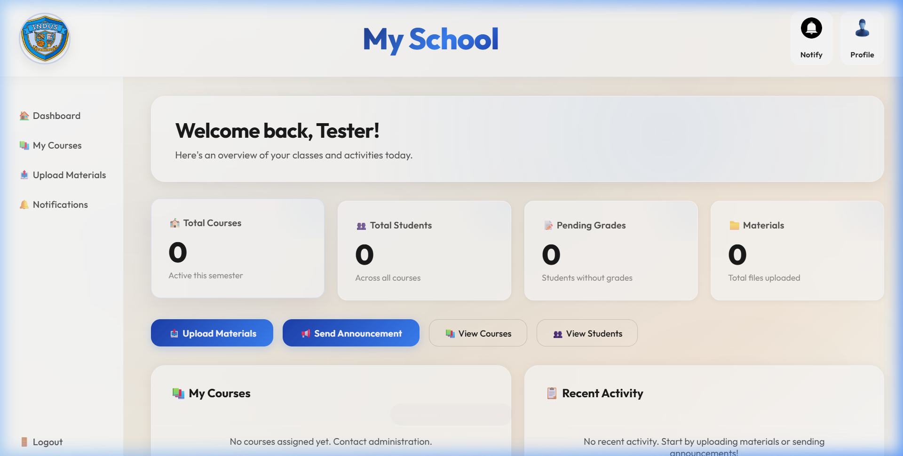
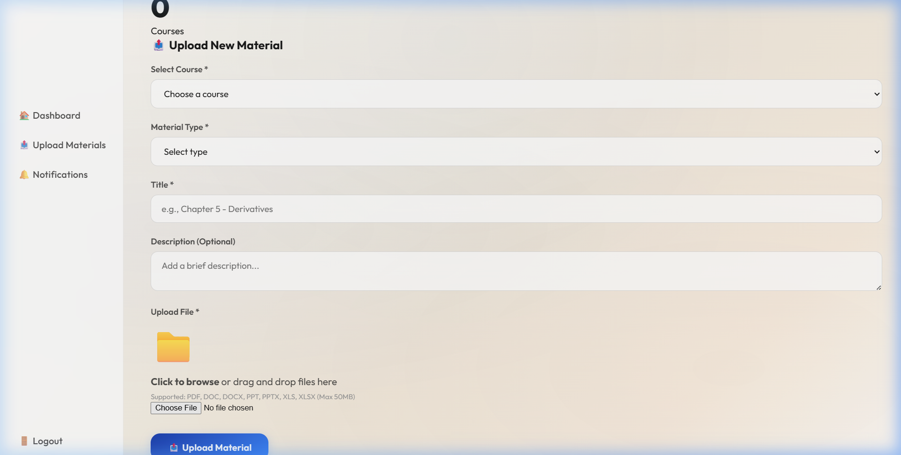
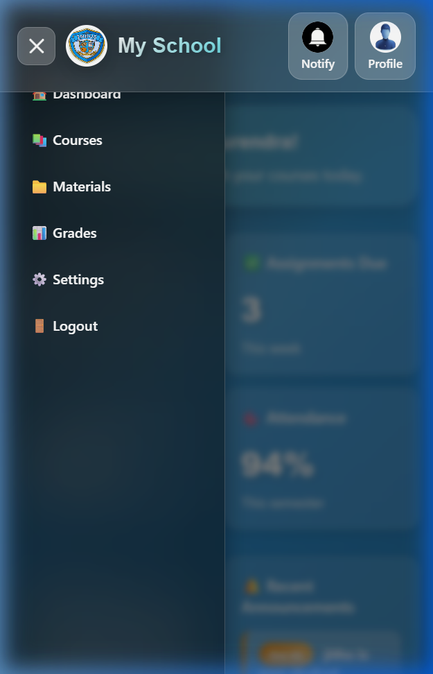
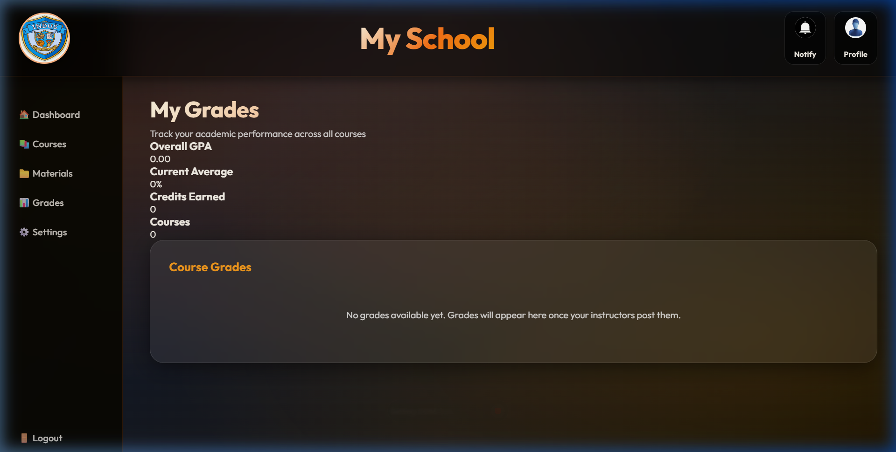

# School Management System - UI Redesign

A complete UI overhaul for the School Management System, introducing distinct and beautiful themes for both Students and Teachers. This project focuses on animated, responsive, and stylish glassmorphism designs while preserving all core functionalities.

---

## 🎨 Overview of Changes

### Student Phase: "Midnight Study" Theme
The student interface was upgraded to a sleek dark mode, featuring:
- **Color Palette:** Dark Charcoal background with Warm Orange/Amber accents.
- **Glassmorphism:** Frosted translucent panels for all content cards.
- **Animations:** Subtle background glowing orbs (`bgPulse`) and smooth fade-ins.
- **Mobile Responsive:** A new off-canvas slide-in sidebar with a hamburger toggle replaces the broken horizontal scrolling nav. 

### Teacher Phase: "Vanilla White" Theme
The teacher interface was completely redesigned to guarantee high contrast and an authoritative, professional appearance that stands apart from the student portal.
- **Color Palette:** Creamy Vanilla White (`#fdfaf6`) with Professional Deep Blue accents (`#1e40af`).
- **Glassmorphism:** Light transparent white cards (`rgba(255, 255, 255, 0.70)`) with subtle dark drop-shadows.
- **Form Styling:** Upgraded dropdowns, text areas, and inputs across all teacher forms (Uploads and Notifications) to match the light theme perfectly.

---

## 📸 Screenshots

### Teacher Dashboard (Vanilla White Theme)

### Teacher Uploads Form

### Student Dashboard - Mobile View

### Student Grades

---

## 🛠️ Technical Details
- Added fully responsive mobile CSS (`d.css` for Dark, `t.css` for Light).
- Maintained all XAMPP/PHP database connections securely.
- Emoji-prefixed page titles and active-state navigation highlights.
- Replaced `
` tags and inline styles with modern CSS variables.
